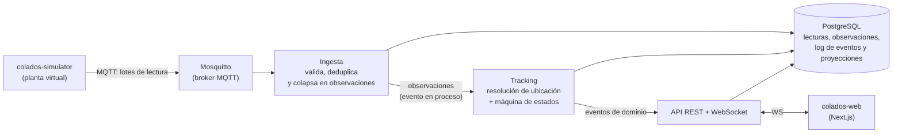

# Colados — Trazabilidad de bobinas de aluminio en patio (simulación Industria 4.0)

> Reimplementación moderna, y esta vez seria, de un TFG de 2021 sobre trazabilidad
> RFID de coladas de aluminio. Proyecto personal de aprendizaje: arquitectura
> orientada a eventos, ingesta de datos sucios de campo y visualización en tiempo real.

---

## 1. El problema (resumen)

En una planta de laminación de aluminio, al terminar una **colada** el material sale
en **bobinas** de varias toneladas. Esas bobinas se apilan en un **patio** (parking)
a la espera de proceso posterior, venta o expedición.

El seguimiento de dónde queda cada bobina era **manual**: el operario anotaba en papel
la ubicación y *después*, si se acordaba, la pasaba al ordenador. El resultado:

- Bobinas "perdidas" que existen físicamente pero no en el sistema.
- Doble ocupación de huecos y reubicaciones no registradas.
- Stock de **sobrantes** (restos de bobina) desconocido → se vuelve a fabricar
  material que ya estaba en el patio.
- Sin trazabilidad de qué bobina se cargó en qué camión ante una reclamación de calidad.
- Latencia: el sistema informático refleja el patio con horas de retraso, o nunca.

El detalle completo del proceso *as-is*, sus puntos de dolor y qué se construyó en 2021
está en [`docs/00-problema-original.md`](docs/00-problema-original.md).

## 2. Qué es este proyecto

No podemos comprar lectores RFID ni una grúa pórtico, así que **simulamos la planta**
y construimos el sistema real encima de ella. La regla que ordena todo el diseño:

> **El simulador solo emite lo que un lector RFID físico podría saber:**
> `(lectorId, EPC, RSSI, timestamp)`.
> Nunca emite "la bobina X está en la zona A".

Todo lo demás —qué bobina es, dónde está, si está almacenada o en tránsito, si el
hueco está libre— es **inferido** por el backend a partir de un flujo de lecturas
ruidoso, duplicado, desordenado e incompleto. Ese problema de inferencia es el
proyecto; el CRUD es el envoltorio.

**Objetivo de aprendizaje: arquitectura orientada a eventos.** Es también el criterio
para resolver empates de diseño: ante dos opciones equivalentes gana la que enseñe más
sobre eventos, *streaming* y tiempo real; lo que no sirva a ese objetivo se resuelve
por la vía más simple que funcione.

## 3. Arquitectura de un vistazo

**Sin broker de eventos.** PostgreSQL hace de log: `raw_read` guarda las lecturas 7 días,
`coil_event` es el libro mayor con retención infinita y las proyecciones se reconstruyen
releyéndolo. Con ~300 lecturas/s en punta y ~600 eventos de negocio al día, Kafka no
aportaba nada que justificara operarlo ([ADR-0011](docs/adr/0011-sin-kafka-de-momento.md)).

Detalle, alternativas descartadas y diagramas C4 en
[`docs/02-arquitectura.md`](docs/02-arquitectura.md).

## 4. Stack

| Capa | Elección | Por qué |
|---|---|---|
| Simulador | Java 21 + Spring Boot | Mismo toolchain; aislado, solo habla MQTT |
| Lectores | Embarcados en las máquinas + tags de ubicación por hueco | Lo que se hace en un patio real; el volumen crece con la actividad, no con el stock |
| Transporte de campo | MQTT (Mosquitto) | Protocolo real de planta: QoS, LWT, ligero |
| Backend | Java 21 + Spring Boot 3 (monolito modular) | Módulos con frontera limpia, un despliegue |
| Persistencia y log de eventos | PostgreSQL 16 | Lecturas, observaciones, `coil_event` append-only y proyecciones reconstruibles |
| Frontend | Next.js + TypeScript + React | Mapa de patio en tiempo real |
| Tiempo real → navegador | WebSocket (STOMP) | Empuje de cambios de ubicación |
| Infra local | Docker Compose | Todo levanta con un comando |
| Observabilidad | Prometheus + Grafana | Métricas de ingesta, lag, tasa de lecturas perdidas |

## 5. Documentación

| Documento | Contenido |
|---|---|
| [`docs/00-problema-original.md`](docs/00-problema-original.md) | Proceso *as-is*, puntos de dolor, qué se hizo en 2021 y por qué no valía |
| [`docs/01-dominio.md`](docs/01-dominio.md) | Lenguaje ubicuo, entidades, máquina de estados de la bobina |
| [`docs/02-arquitectura.md`](docs/02-arquitectura.md) | Componentes, C4, topología del patio, alternativas |
| [`docs/03-contratos-eventos.md`](docs/03-contratos-eventos.md) | Topics MQTT, lotes, observaciones, idempotencia |
| [`docs/04-simulador.md`](docs/04-simulador.md) | Modelo físico de la planta y modelo de ruido RFID |
| [`docs/05-resolucion-ubicacion.md`](docs/05-resolucion-ubicacion.md) | El algoritmo central: de lecturas sucias a ubicación |
| [`docs/06-roadmap.md`](docs/06-roadmap.md) | Fases de entrega |
| [`docs/decisiones-abiertas.md`](docs/decisiones-abiertas.md) | Lo que aún no está decidido |
| [`docs/adr/`](docs/adr/) | Registro de decisiones de arquitectura (ADR) |

## 6. Estado

**Fase 0 — Diseño.** No hay código todavía. Este repositorio contiene, por ahora,
la definición del problema y la arquitectura. Ver [`docs/06-roadmap.md`](docs/06-roadmap.md).

## 7. Licencia

Ver [`LICENSE`](LICENSE).
