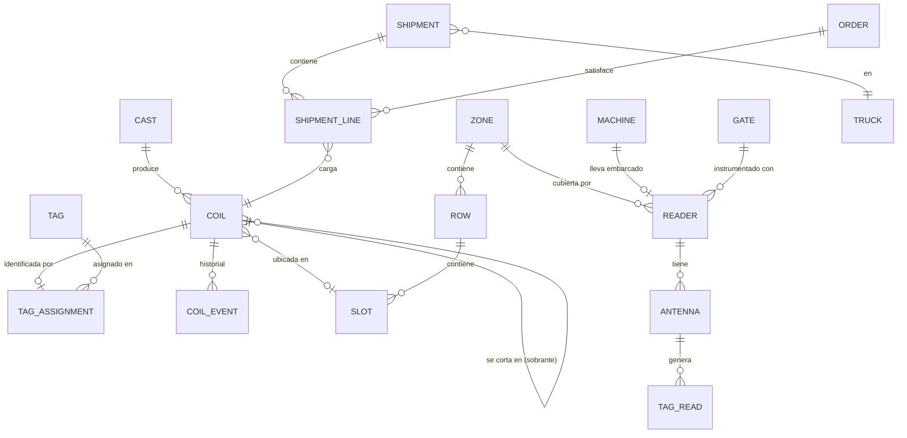
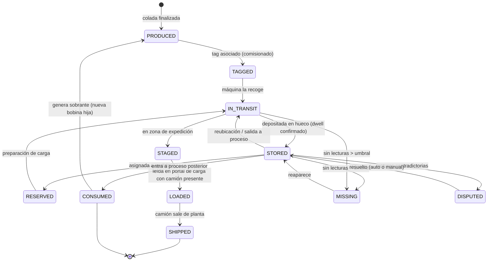

# 01 — Dominio, lenguaje ubicuo y modelo

## 1. Glosario (lenguaje ubicuo)

Se usa el término en castellano en el dominio y en la UI; el identificador en inglés
en el código, para evitar `Colada.getColadaId()` mezclado con `Coil`.

| Término | Código | Definición |
|---|---|---|
| Colada | `Cast` | Carga de aluminio fundida y colada con una aleación y composición. Unidad de trazabilidad de calidad. |
| Bobina / rollo | `Coil` | Rollo de aluminio de varias toneladas producido a partir de una colada. Unidad física que se mueve y se almacena. |
| Sobrante | `Remnant` (una `Coil` con `parentCoilId`) | Resto de bobina tras un consumo parcial. Tiene identidad y ubicación propias. |
| Tag | `Tag` | Transpondedor RFID pasivo UHF adherido a la etiqueta de la bobina. Identificado por su **EPC**. |
| EPC | `epc` | Código único del tag. **No es el identificador de la bobina**: hay una asociación que se crea, se rompe y se reasigna. |
| Lector | `Reader` | Dispositivo que lee tags. Tres tipos: de zona, embarcado en máquina, de portal/puerta. |
| Antena | `Antenna` | Cada lector tiene 1..N antenas; la antena es lo que da resolución espacial. |
| Lectura | `TagRead` | Evento crudo: una antena vio un EPC en un instante con una potencia (RSSI). Viaja siempre dentro de un `TagReadBatch`. |
| Observación | `Observation` | Lecturas continuas del mismo EPC en la misma antena colapsadas en un intervalo. Es lo que se persiste. |
| Patio | `Yard` | Zona de almacenamiento exterior/cubierta. |
| Zona | `Zone` | Subdivisión del patio (p. ej. nave A, exterior norte). |
| Calle | `Row` | Pasillo dentro de una zona. |
| Hueco | `Slot` | Posición concreta donde se deja una bobina. Puede admitir apilamiento. |
| Máquina | `Machine` | Carretilla de bobinas, puente grúa o pórtico. Transporta bobinas. |
| Portal | `Gate` | Punto de paso instrumentado (salida de línea, báscula, puerta de expedición). |
| Pedido | `Order` | Demanda de cliente que consume bobinas del stock. |
| Expedición | `Shipment` | Carga de un conjunto de bobinas en un camión contra uno o varios pedidos. |
| Camión | `Truck` | Vehículo de salida; identificado por matrícula. |

## 2. Asunciones de la simulación

Valores plausibles, no datos reales. Todos parametrizables.

| Parámetro | Valor por defecto |
|---|---|
| Peso de bobina | 6–12 t |
| Bobinas por colada | 8–20 |
| Frecuencia de colada | 1 cada 3–5 h |
| Zonas de patio | 4 (2 cubiertas, 2 exteriores) |
| Huecos por zona | 60–120 |
| Apilamiento | Hasta 2 alturas solo en zonas cubiertas |
| Máquinas | 3 carretillas + 1 pórtico |
| Ciclo de máquina (coger→dejar) | 4–9 min |
| Camiones/día | 10–20, 2–4 bobinas por camión |

## 3. Entidades y relaciones



### Nota sobre `TAG_ASSIGNMENT`

Modelar la asignación EPC↔bobina como una **entidad con vigencia temporal**
(`epc, coilId, from, to, reason`) y no como una columna en `coil` es deliberado:

- Los tags se rompen y se sustituyen → la bobina cambia de EPC.
- Los tags se reutilizan → el mismo EPC apunta a otra bobina meses después.
- Al reprocesar el histórico hay que resolver el EPC **con la vigencia de ese momento**,
  no con la actual. Si no, el replay produce resultados falsos.

Esta es una de esas cosas que en un prototipo se hace con una columna y en producción
te cuesta un incidente.

## 4. Ciclo de vida de una bobina



Dos estados que no existían en el prototipo de 2021 y que son los que hacen creíble
el sistema:

- **`MISSING`**: no es un error del software, es el estado normal de una bobina que
  el hardware dejó de ver. El sistema debe **decir que no lo sabe** en vez de mentir
  con la última posición conocida como si fuera actual.
- **`DISPUTED`**: dos zonas afirman tener la misma bobina. Se marca, se alerta y se
  ofrece resolución manual. Elegir en silencio una de las dos es cómo se corrompe
  un inventario.

Cada estado de ubicación lleva asociada una **confianza** y un **`observedAt`**,
no solo un valor. La UI muestra "Calle C-12 · confianza alta · visto hace 40 s"
en vez de "Calle C-12" a secas.

## 5. Invariantes del dominio

Reglas que el sistema debe hacer cumplir y sobre las que se alerta al violarse:

1. Una bobina está en **como máximo un** hueco a la vez.
2. Un hueco tiene ocupación ≤ su capacidad (altura de apilamiento).
3. Una bobina en estado `IN_TRANSIT` está asociada a **exactamente una** máquina.
4. Una máquina transporta ≤ su capacidad (normalmente 1 bobina).
5. Una bobina `SHIPPED` no puede volver a aparecer en el patio (si lo hace → alerta grave).
6. Un EPC tiene **como máximo una** asignación vigente en un instante dado.
7. El peso de los sobrantes de una bobina ≤ peso de la bobina padre.
8. Una bobina `RESERVED` para el pedido A no puede cargarse contra el pedido B.

Estas invariantes son la fuente natural del catálogo de **alertas** de la UI: cada
una que se rompe es una anomalía real de planta, no un bug.

## 6. Modelo de datos (borrador)

Separado en tres capas según su naturaleza.

### Datos maestros (mutables, baja cardinalidad)

`zone`, `row`, `slot`, `reader`, `antenna`, `machine`, `gate`, `truck`, `customer`, `alloy_spec`

### Hechos inmutables (append-only, alta cardinalidad)

```
observation(id, reader_id, antenna_id, epc, first_seen, last_seen,
            read_count, rssi_p75, max_gap_ms, open)
coil_event(id, coil_id, type, payload jsonb, occurred_at, recorded_at, caused_by)
```

`read_at` (reloj del lector) y `received_at` (reloj del servidor) separados: el desfase
de reloj es un fenómeno real y hay que poder medirlo, no ocultarlo.

### Proyecciones (derivadas, reconstruibles desde los hechos)

```
coil_location(coil_id, slot_id, machine_id, state, confidence, since, last_seen_at)
slot_occupancy(slot_id, occupied_count, coil_ids[], updated_at)
stock_summary(alloy, thickness, width, free_kg, reserved_kg, remnant_kg)
reader_health(reader_id, last_heartbeat, reads_last_5m, status)
```

**Cualquier proyección se puede borrar y reconstruir** reproduciendo los hechos.
Ese es todo el sentido de la separación y la razón principal para meter Kafka
(ver [ADR-0002](adr/0002-kafka-como-backbone.md)).
