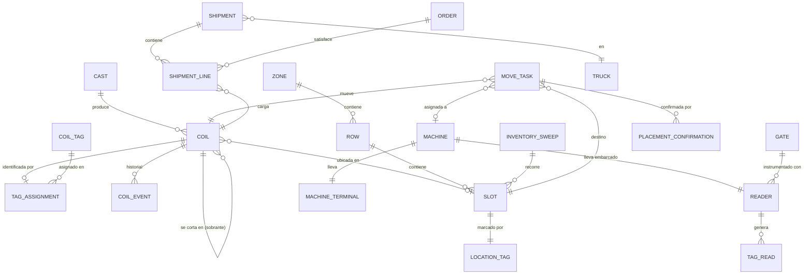
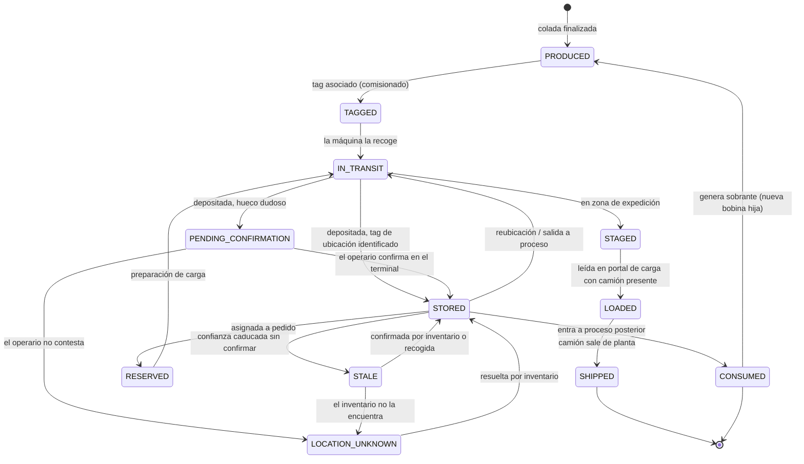

# 01 — Dominio, lenguaje ubicuo y modelo

## 1. Glosario (lenguaje ubicuo)

Se usa el término en castellano en el dominio y en la UI; el identificador en inglés
en el código, para evitar `Colada.getColadaId()` mezclado con `Coil`.

| Término | Código | Definición |
|---|---|---|
| Colada | `Cast` | Carga de aluminio fundida y colada con una aleación y composición. Unidad de trazabilidad de calidad. |
| Bobina / rollo / **lote** | `Coil` | Rollo de aluminio de varias toneladas producido a partir de una colada. **Unidad física que se mueve y se almacena**, y la que ocupa un hueco. En planta se le llama indistintamente bobina o lote. |
| Sobrante | `Remnant` (una `Coil` con `parentCoilId`) | Resto de bobina tras un consumo parcial. Tiene identidad y ubicación propias. |
| Tag de bobina | `CoilTag` | Transpondedor RFID pasivo UHF adherido a la etiqueta de la bobina. Identificado por su **EPC**. |
| Tag de ubicación | `LocationTag` | Transpondedor pasivo empotrado en el suelo o la estructura, **uno por hueco**. Su EPC está mapeado a un `slotId` en los datos maestros. |
| EPC | `epc` | Código único de un tag. **No dice de qué tipo es**: el lector solo ve el código y es el backend quien lo resuelve contra el registro de tags. |
| Lector | `Reader` | Dispositivo que lee tags. Tres tipos: embarcado en máquina, de portal y de mano ([ADR-0010](adr/0010-lector-en-la-maquina.md)). |
| Inventario | `InventorySweep` | Recorrido de un operario con lector de mano confirmando qué hay en cada hueco. Única reconfirmación sistemática del patio. |
| Terminal | `MachineTerminal` | Pantalla montada en la cabina de la máquina. Muestra la tarea y recoge la confirmación del operario cuando el sistema no está seguro ([ADR-0012](adr/0012-terminal-y-gestion-por-excepcion.md)). |
| Tarea de movimiento | `MoveTask` | Lo **planificado**: "coge la 4471 y llévala a C5-08". Se contrasta con lo observado. |
| Confirmación | `PlacementConfirmation` | Lo **declarado** por el operario. Tercera fuente junto a lo planificado y lo observado. |
| Lectura | `TagRead` | Evento crudo: una antena vio un EPC en un instante con una potencia (RSSI). Viaja siempre dentro de un `TagReadBatch`. |
| Observación | `Observation` | Lecturas continuas del mismo EPC en la misma antena colapsadas en un intervalo. Es lo que se persiste. |
| Patio | `Yard` | Zona de almacenamiento exterior/cubierta. |
| Zona | `Zone` | Subdivisión del patio (p. ej. nave A, exterior norte). |
| Calle | `Row` | Pasillo dentro de una zona. |
| Hueco | `Slot` | Posición concreta donde se deja una bobina. Tiene una **capacidad** configurable: por defecto 1 ([ADR-0013](adr/0013-patio-simple-y-capacidad-de-hueco.md)). |
| Máquina | `Machine` | Carretilla de bobinas, puente grúa o pórtico. Transporta bobinas y **lleva el lector embarcado**. |
| Portal | `Gate` | Punto de paso instrumentado (salida de línea, báscula, puerta de expedición). |
| Pedido | `Order` | Demanda de cliente que consume bobinas del stock. |
| Expedición | `Shipment` | Carga de un conjunto de bobinas en un camión contra uno o varios pedidos. |
| Camión | `Truck` | Vehículo de salida; identificado por matrícula. |

## 2. Asunciones de la simulación

Valores plausibles, no datos reales. Todos parametrizables.

Dos perfiles, mismo código y misma topología, distinto tamaño
([ADR-0013](adr/0013-patio-simple-y-capacidad-de-hueco.md)):

| Parámetro | `simple` (por defecto) | `full` (demo y evaluación) |
|---|---|---|
| Zonas | 1 | 5 |
| Huecos | 30 (3 calles × 10) | ~300 |
| **Capacidad por hueco** | **1** | 1–2 según zona |
| Máquinas | 1 carretilla | 3 carretillas + 1 pórtico |
| Portales | salida de línea | línea, báscula, expedición |
| Bobinas por colada | 4–6 | 8–20 |
| Peso de bobina | 6–12 t | 6–12 t |
| Frecuencia de colada | 1 cada 3–5 h | 1 cada 3–5 h |
| Ciclo de máquina (coger→dejar) | 4–9 min | 4–9 min |
| Camiones/día | 3–5 | 10–20, 2–4 bobinas por camión |

Con **capacidad 1 la ocupación de un hueco es un booleano** y no hay ambigüedad al
recoger. Subirla a 2 no cambia el modelo ni el algoritmo: solo hace que el terminal
pregunte *"¿cuál te llevas?"* cuando el lector ve dos bobinas en el mismo hueco.

**No se modela la física del apilamiento** —ni orden LIFO, ni tener que mover la de
arriba, ni apantallamiento entre bobinas—: un hueco es un conjunto de hasta N bobinas,
sin orden.

## 3. Entidades y relaciones



### Nota sobre `TAG_ASSIGNMENT`

Modelar la asignación EPC↔bobina como una **entidad con vigencia temporal**
(`epc, coilId, from, to, reason`) y no como una columna en `coil` es deliberado:

- Los tags se rompen y se sustituyen → la bobina cambia de EPC.
- Los tags se reutilizan → el mismo EPC apunta a otra bobina meses después.
- Al reprocesar el histórico hay que resolver el EPC **con la vigencia de ese momento**,
  no con la actual. Si no, el replay produce resultados falsos.

Esta es una de esas cosas que en un prototipo se hace con una columna y en producción
te cuesta un incidente.

## 4. Ciclo de vida de una bobina



Dos estados que no existían en el prototipo de 2021 y que son los que hacen creíble
el sistema:

- **`PENDING_CONFIRMATION`**: la bobina se depositó pero el hueco no está claro. El
  terminal pregunta al operario. Es el estado que hace que el sistema **no tenga que
  adivinar** ([ADR-0012](adr/0012-terminal-y-gestion-por-excepcion.md)).
- **`LOCATION_UNKNOWN`**: se preguntó y no hubo respuesta, o no había a quién preguntar.
  El sistema **admite que no sabe dónde está** en lugar de deducir el hueco más probable.
  Se resuelve en el siguiente inventario.
- **`STALE`**: el sistema sigue diciendo dónde cree que está, pero han pasado semanas
  desde la última confirmación. Con lectores embarcados **nadie vuelve a mirar una
  bobina depositada** ([ADR-0010](adr/0010-lector-en-la-maquina.md)), así que la
  antigüedad del dato es información de primer orden.

Cada estado de ubicación lleva asociada una **confianza** y una **fecha de última
confirmación**, no solo un valor. La UI muestra "C5-08 · confirmado hace 3 días" en vez
de "C5-08" a secas. Esa diferencia es la que separa un inventario en el que la gente
confía de uno que se acaba ignorando — que es lo que pasó con el sistema de 2021.

## 5. Invariantes del dominio

Reglas que el sistema debe hacer cumplir y sobre las que se alerta al violarse:

1. Una bobina está en **como máximo un** hueco a la vez.
2. Un hueco tiene ocupación ≤ su capacidad (`slot.capacity`, por defecto 1). Restricción
   en la base de datos, no comprobación en el código.
3. Una bobina en estado `IN_TRANSIT` está asociada a **exactamente una** máquina. Dos
   lectores de máquina no pueden reclamarla a la vez.
4. Una máquina transporta ≤ su capacidad (normalmente 1 bobina).
5. Una bobina `SHIPPED` no puede volver a aparecer en el patio (si lo hace → alerta grave).
6. Un EPC tiene **como máximo una** asignación vigente en un instante dado.
7. El peso de los sobrantes de una bobina ≤ peso de la bobina padre.
8. Una bobina `RESERVED` para el pedido A no puede cargarse contra el pedido B.
9. Un tag de ubicación corresponde a **exactamente un** hueco, y todo hueco tiene el
   suyo. Un EPC de ubicación leído que no esté en el registro es una anomalía.
10. Una `MoveTask` está asignada a **como máximo una** máquina a la vez.
11. Una confirmación del operario **nunca sobrescribe en silencio** una observación RF
    contradictoria: ambas se guardan y la discrepancia se registra.

Estas invariantes son la fuente natural del catálogo de **alertas** de la UI: cada
una que se rompe es una anomalía real de planta, no un bug.

## 6. Modelo de datos (borrador)

Separado en tres capas según su naturaleza.

### Datos maestros (mutables, baja cardinalidad)

`zone`, `row`, `slot`, `location_tag`, `reader`, `machine`, `machine_terminal`, `gate`, `truck`, `customer`, `alloy_spec`

`location_tag(epc, slot_id, installed_at, status)` es el mapa EPC→hueco. Sin él, un
lector de máquina solo ve códigos sin significado.

Todos estos datos se cargan desde **`infra/plant-layout.yaml`**, un único fichero
declarativo compartido por el simulador y el backend: el simulador lo usa para la
geometría física y el backend para el modelo lógico. Tenerlo por duplicado sería
garantizar que las dos visiones del patio se desincronicen, que es un fallo silencioso y
muy molesto de diagnosticar.

### Hechos inmutables (append-only)

```
observation(id, reader_id, epc, epc_kind, first_seen, last_seen,
            read_count, rssi_p75, max_gap_ms, open)
coil_event(id, coil_id, type, payload jsonb, occurred_at, recorded_at, caused_by)
inventory_reading(id, sweep_id, slot_id, epc, read_at, outcome)
placement_confirmation(id, move_task_id, coil_id, slot_id, confirmed_by,
                       asked_at, answered_at, agreed_with_rf)
```

`first_seen` / `last_seen` vienen del reloj **del lector** y `recorded_at` del servidor:
el desfase de reloj es un fenómeno real y hay que poder medirlo, no ocultarlo.

Las lecturas crudas de las que salen estas observaciones viven en `raw_read`,
particionada por día y con 7 días de retención
([ADR-0011](adr/0011-sin-kafka-de-momento.md)).

### Proyecciones (derivadas, reconstruibles desde los hechos)

```
coil_location(coil_id, slot_id, machine_id, state, confidence,
              since, last_confirmed_at, confirmed_by)
slot_occupancy(slot_id, occupied_count, coil_ids[], updated_at)
stock_summary(alloy, thickness, width, free_kg, reserved_kg, remnant_kg)
reader_health(reader_id, last_heartbeat, reads_last_5m, status)
```

**Cualquier proyección se puede borrar y reconstruir** reproduciendo los hechos.
Ese es todo el sentido de la separación: un `TRUNCATE` y una lectura ordenada de
`coil_event` devuelven el patio a su estado correcto
([ADR-0011](adr/0011-sin-kafka-de-momento.md)).
