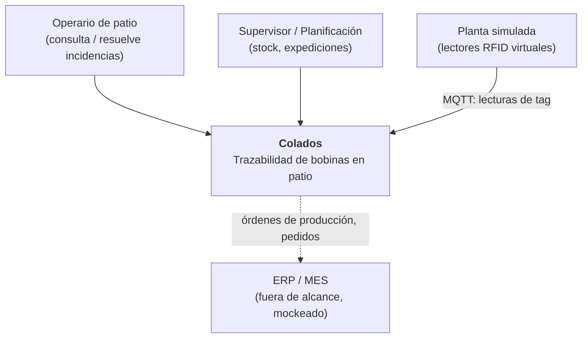
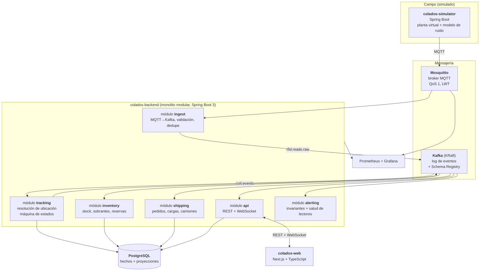

# 02 — Arquitectura

## 1. Principios que ordenan el diseño

1. **El simulador no sabe nada del dominio de negocio.** Emite lecturas crudas de tag
   por MQTT y punto. No conoce la base de datos, no llama a la API, no dice dónde está
   nada. Si mañana llega hardware real, se sustituye el simulador y nada más cambia.
   ([ADR-0006](adr/0006-simulador-emite-solo-lecturas-crudas.md))
2. **Los hechos son inmutables; el estado es una opinión derivada.** Las lecturas y
   los eventos de dominio se guardan para siempre; la ubicación actual es una proyección
   recalculable.
3. **Preferir un monolito modular a microservicios prematuros.** Las fronteras se
   trazan en módulos con contratos explícitos, no en despliegues.
   ([ADR-0003](adr/0003-monolito-modular.md))
4. **El sistema debe poder decir "no lo sé".** Confianza y frescura del dato son
   ciudadanos de primera clase, no un detalle de la UI.
5. **Todo se levanta con un `docker compose up`.** Si el entorno local cuesta,
   el proyecto muere.

## 2. Contexto (C4 nivel 1)



## 3. Contenedores (C4 nivel 2)



### Por qué el módulo `ingest` no es un simple bridge

Existen puentes MQTT→Kafka de estantería (Kafka Connect, el bridge nativo de EMQX).
Se descarta usarlos como única pieza porque queremos una **puerta de calidad** en
la entrada, y esa puerta es parte del aprendizaje:

- **Validación de esquema**: una lectura malformada va a la DLQ, no rompe el consumidor.
- **Idempotencia**: `(readerId, batchSeq)` como clave; MQTT QoS 1 garantiza
  *at-least-once*, así que los duplicados de transporte llegan seguro.
- **Normalización de reloj**: se registran `read_at` y `received_at` y se mide el desfase.
- **Enriquecimiento mínimo**: se añade `plantId`, `receivedAt`, `traceId`.
- **Clasificación del EPC**: contra el registro de tags, un EPC leído es de bobina, de
  ubicación o desconocido. El lector no lo sabe; aquí se decide.
- **Particionado consciente**: clave de Kafka = `readerId` de la máquina. Es la decisión
  que cambia con [ADR-0010](adr/0010-lector-en-la-maquina.md): el razonamiento ya no es
  "todo lo que se sabe de una bobina", sino **"todo lo que ve una máquina"** — el tag de
  la bobina y los de ubicación tienen que llegar juntos y en orden al mismo procesador,
  o no se puede correlacionar el depósito con el hueco.

Ojo con lo último: particionar por `epc`, que era lo natural con antenas fijas, aquí
**rompe el algoritmo**, porque separa el tag de la bobina de los tags de ubicación que
le dan sentido. La clave de partición **es** una decisión de arquitectura, y cambia con
la topología de lectores.

## 4. Flujo de eventos: quién publica, quién consume, quién persiste

El diagrama anterior dice qué piezas hay, pero no quién habla con quién en cada salto.
Esto es lo concreto.

### Fases 1 y 2 (sin Kafka)

| Salto | Transporte | Publica | Consume | Se persiste en |
|---|---|---|---|---|
| `TagReadBatch` | **MQTT** `colados/PLANT-01/reader/+/reads` | simulador (lectores de máquina, portal y mano) | `ingest` | tabla `raw_read`, 48 h |
| `Observation` | **en proceso** (`ApplicationEventPublisher`) | `ingest` | `tracking` | tabla `observation` |
| `CoilPlaced`, `CoilMissing`… | **en proceso** | `tracking` | `inventory`, `alerting`, `api` | tabla `coil_event` |
| cambio de ubicación | **WebSocket/STOMP** | `api` | navegador | — |

Solo el primer salto es red de verdad. Los intermedios son llamadas Spring dentro del
mismo proceso, y **quien produce el evento es quien lo persiste**, en la misma
transacción. Es simple y es correcto para un único despliegue.

Lo que se persiste **antes** de razonar: `ingest` guarda el lote antes de interpretarlo.
Si el motor de resolución revienta, el dato está a salvo y se reprocesa.

### Fase 3 (con Kafka)

```
simulador --MQTT--> ingest --> rfid.reads.raw --> [colapso] --> rfid.observations
                                                                      |
                                                             tracking (Kafka Streams)
                                                                      |
                                                                 coil.events
                                                                      |
                                    +-----------+-----------+---------+
                                    |           |           |         |
                                projector   inventory   alerting     api
                                    |                                 |
                                PostgreSQL                        WebSocket
```

El cambio que importa: **`tracking` deja de escribir en la base de datos.** Solo publica
en Kafka. Aparece un consumidor nuevo, el **projector**, cuyo único trabajo es leer
`coil.events` y escribir `coil_event` y las proyecciones.

Se separa por una razón concreta: si `tracking` escribiera en Kafka **y** en Postgres
tendría una **escritura dual sin atomicidad**. Si el commit de Kafka va bien y el de
Postgres falla, los dos almacenes divergen para siempre y nadie se entera. Las salidas
son el patrón *transactional outbox* o —más simple— que Kafka sea la única fuente de
verdad y la base de datos sea puramente derivada. Se elige lo segundo, y es
precisamente lo que convierte "borrar las proyecciones y reconstruirlas" en una
operación rutinaria.

### Dónde vive cada dato

Resumen de [ADR-0009](adr/0009-estrategia-de-almacenamiento.md):

| Dato | Dónde | Responde a |
|---|---|---|
| Lecturas crudas | Kafka, 7 d | "¿Por qué el sistema creyó eso a las 09:14?" |
| Observaciones | PostgreSQL | "¿Qué lector vio este tag, cuándo y cuánto tiempo?" |
| Eventos de dominio | PostgreSQL, infinita | "¿Qué le pasó a la bobina 4471?" |
| Proyecciones | PostgreSQL | "¿Dónde está ahora?" |
| Métricas | Prometheus | "¿Cuántas lecturas/s da el lector de la carretilla 2?" |

Mosquitto **no aparece en esta tabla**: reparte y olvida, no almacena nada.

## 5. El componente central: resolución de ubicación

Todo lo demás es infraestructura. Este módulo es el proyecto:

```
lecturas del lector embarcado (bobina transportada + tags de ubicación al pasar)
        ↓  clasificar EPC: ¿tag de bobina o tag de ubicación?
        ↓  máquina de estados de la carga: VACÍA ⇄ CARGADA
        ↓  las dos transiciones SON los eventos: CoilPickedUp y CoilPlaced
        ↓  localizar la transición entre los tags de ubicación de la ventana
        ↓  ¿persiste el tag después de soltar? → ese es el hueco
        ↓  confianza que decae desde la última confirmación
ubicación con confianza + eventos de dominio
```

Los tres eventos que se esperan del sistema —cargada, en tránsito, depositada aquí—
**son las transiciones de una máquina de estados de dos posiciones**. Lo difícil no es
el modelo: es decidir el instante exacto de cada transición cuando el tag no desaparece
de golpe, sino que se desvanece.

Detalle completo del algoritmo en
[`05-resolucion-ubicacion.md`](05-resolucion-ubicacion.md).

## 6. Topología del patio simulado

```
PATIO
├── ZONA A (cubierta)      calles A1..A4 × 20 huecos, apilable ×2
├── ZONA B (cubierta)      calles B1..B3 × 20 huecos, apilable ×2
├── ZONA C (exterior)      calles C1..C5 × 24 huecos, sin apilar
├── ZONA D (exterior)      calles D1..D2 × 24 huecos, sin apilar
└── ZONA E (expedición)    playa de carga, 12 posiciones

Cada hueco lleva empotrado un TAG DE UBICACIÓN pasivo (~300 en total),
cuyo EPC está mapeado a su slotId en los datos maestros.

Lectores (solo 7 en toda la planta)
├── MACHINE   4 — uno por máquina. Lee el tag de la bobina que transporta
│                 y los tags de ubicación por los que pasa.
├── GATE      3 — salida de línea, báscula, puerta de expedición.
└── HANDHELD  1-2 — lector de mano para el inventario periódico.
```

Los lectores **viajan con las máquinas, no cubren el patio**
([ADR-0010](adr/0010-lector-en-la-maquina.md)). Consecuencias que ordenan todo lo demás:

- **Una bobina depositada no genera ninguna lectura.** El volumen es proporcional a la
  actividad, no al inventario: patio lleno y sin movimiento = cero eventos.
- **Nadie reconfirma el patio.** La única verificación sistemática es el inventario con
  lector de mano. Por eso la confianza de una ubicación **decae con el tiempo** y el
  inventario es parte del dominio, no un extra.
- **La ubicación depende de un único instante**: el momento en que el lector deja de ver
  el tag de la bobina. Acertar ese instante es el problema central del sistema.

## 7. Frontend

Next.js + TypeScript. Vistas:

| Vista | Contenido |
|---|---|
| **Mapa de patio** | Plano 2D (SVG/Canvas) con zonas, calles y huecos coloreados por ocupación, estado y confianza. Actualización en vivo por WebSocket. |
| **Ficha de bobina** | Datos, colada de origen, linaje de sobrantes y **línea de tiempo completa** de eventos. La trazabilidad que en 2021 no existía. |
| **Stock** | Por aleación / espesor / ancho. Libre vs reservado vs expedido. Sobrantes destacados. |
| **Expediciones** | Pedidos, preparación de carga, camión, albarán. |
| **Alertas** | Invariantes violadas, bobinas en `LOCATION_UNKNOWN`, ubicaciones `STALE`, discrepancias de inventario, lectores caídos. |
| **Inventario** | Lanzar un recorrido, ver confirmaciones y discrepancias, resolver casos abiertos. |
| **Consola del simulador** | Velocidad de simulación, perillas de ruido, inyección de anomalías. Convierte la demo en algo interactivo. |

La consola del simulador es, para un proyecto de portfolio, la vista más valiosa:
permite subir el ruido en directo y enseñar cómo el sistema pasa de "ubicación
confirmada" a "confianza baja" y luego a `STALE`, y cómo un inventario lo devuelve todo
a su sitio.

## 8. Transporte al navegador

WebSocket con STOMP sobre Spring. Se descarta SSE pese a ser más simple porque
la consola del simulador necesita canal de vuelta y no queremos dos mecanismos.

Topics de suscripción:
```
/topic/yard/{zoneId}      cambios de ocupación de una zona
/topic/coil/{coilId}      eventos de una bobina concreta
/topic/alerts             alertas
/topic/sim/status         estado del simulador
```

## 9. Observabilidad

Sin esto no se puede razonar sobre un sistema de eventos:

- **Métricas**: lecturas/s por lector, ratio de descarte, lag de consumidor Kafka,
  latencia depósito→ubicación resuelta (p50/p95/p99), bobinas en `LOCATION_UNKNOWN` y
  `STALE`, antigüedad media de la última confirmación.
- **Trazas**: `traceId` propagado desde la lectura MQTT hasta el mensaje WebSocket.
  Poder seguir *una* lectura por todo el sistema es lo que hace depurable esto.
- **Métrica estrella**: *precisión de ubicación*. Como el simulador **conoce la verdad
  física**, puede publicar la posición real por un canal aparte (`sim.groundtruth`)
  que el backend **no consume**, pero contra el que se puede evaluar. Da un número
  objetivo: "el motor de resolución acierta el 97,3 % de las ubicaciones con 15 % de
  lecturas perdidas". Eso es un resultado presentable, no una opinión.

## 10. Alternativas consideradas y descartadas

| Alternativa | Por qué no |
|---|---|
| Solo MQTT + Postgres, sin Kafka | Suficiente para funcionar, pero se pierde el replay, que es el mayor valor didáctico y práctico. Se mantiene como plan B si Kafka lastra el desarrollo (ver ADR-0002). |
| Solo Kafka, sin MQTT | Kafka no es un protocolo de campo: no hay clientes en microcontroladores, ni QoS por mensaje, ni Last Will. Perdería el realismo industrial. |
| RabbitMQ en lugar de ambos | Buena cola, mal log. Sin retención larga ni replay ni reproceso desde offset. |
| Redis Streams | Ligero y con consumer groups, pero la retención y el ecosistema de stream processing quedan cortos. |
| Microservicios desde el día 1 | Coste operativo desproporcionado para un proyecto personal; las fronteras del dominio aún no están estabilizadas. |
| Event sourcing puro (sin tablas de estado) | Consultas de stock y mapa de patio se vuelven costosas. Se opta por híbrido (ADR-0004). |
| MongoDB | Los invariantes del dominio son relacionales (ocupación de huecos, reservas). Postgres con `jsonb` cubre la parte flexible. |
| Simulador en Python | Más rápido de escribir y con mejores librerías de simulación (SimPy, NumPy), pero añade un segundo toolchain y duplica los esquemas. Descartado en [ADR-0007](adr/0007-tecnologia-del-simulador.md). |

## 11. Repositorio

Monorepo:

```
colados/
├── docs/
├── simulator/          Spring Boot — planta virtual
├── backend/            Spring Boot — monolito modular
│   ├── ingest/
│   ├── tracking/
│   ├── inventory/
│   ├── shipping/
│   ├── alerting/
│   └── api/
├── contracts/          esquemas de eventos compartidos (fuente de verdad)
├── web/                Next.js
├── infra/              docker-compose, configuración Mosquitto/Kafka, dashboards Grafana
└── tools/              generación de datos, scripts de evaluación
```

`contracts/` es un módulo aparte y deliberadamente aburrido: define los esquemas de
evento y genera los tipos de Java y de TypeScript. Es la única dependencia que
simulador, backend y web comparten, y evita que los tres deriven por su cuenta.
