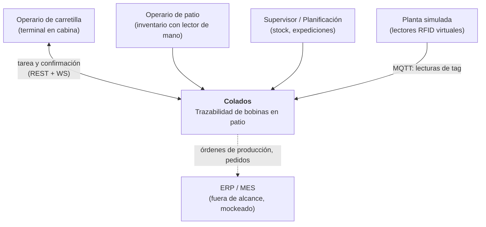
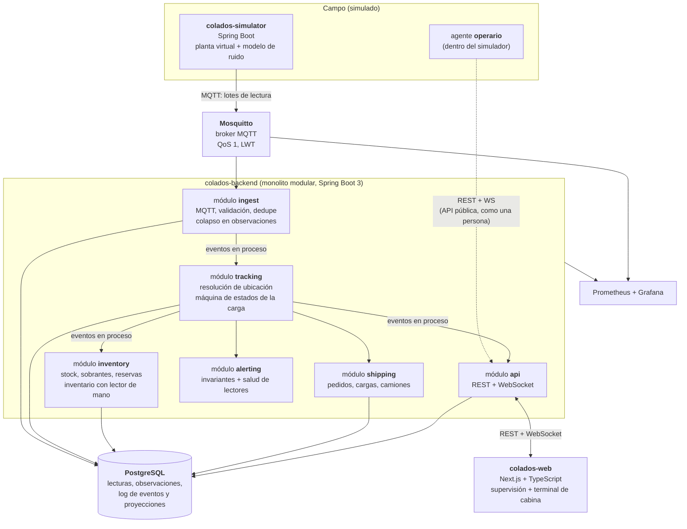

# 02 — Arquitectura

## 1. Principios que ordenan el diseño

1. **Los sensores simulados no saben nada del dominio.** Los lectores emiten lecturas
   crudas por MQTT y punto: no conocen la base de datos ni dicen dónde está nada. Si
   mañana llega hardware real, se sustituyen y nada más cambia
   ([ADR-0006](adr/0006-simulador-emite-solo-lecturas-crudas.md)). El **operario**
   simulado es otra cosa: usa la API pública igual que una persona con el terminal
   ([ADR-0012](adr/0012-terminal-y-gestion-por-excepcion.md)).
2. **Los hechos son inmutables; el estado es una opinión derivada.** Las lecturas y
   los eventos de dominio se guardan para siempre; la ubicación actual es una proyección
   recalculable.
3. **Preferir un monolito modular a microservicios prematuros.** Las fronteras se
   trazan en módulos con contratos explícitos, no en despliegues.
   ([ADR-0003](adr/0003-monolito-modular.md))
4. **El sistema debe poder decir "no lo sé".** Confianza y frescura del dato son
   ciudadanos de primera clase, no un detalle de la UI.
5. **Todo se levanta con un `docker compose up`.** Si el entorno local cuesta,
   el proyecto muere.

## 2. Contexto (C4 nivel 1)



## 3. Contenedores (C4 nivel 2)



**No hay Kafka** ([ADR-0011](adr/0011-sin-kafka-de-momento.md)). Con ~300 lecturas/s en
punta, 7 claves de partición y ~600 eventos de dominio al día, ningún argumento técnico
lo sostenía. PostgreSQL hace de log de eventos y el fan-out entre módulos es en proceso.
La puerta queda abierta: los esquemas van versionados y las claves de partición están
decididas, así que migrar sería añadir un productor, no reescribir el modelo.

### Por qué `ingest` es una puerta de calidad, no un simple volcado

`ingest` no se limita a copiar el mensaje MQTT a una tabla:

- **Validación de esquema**: una lectura malformada va a la DLQ, no rompe el consumidor.
- **Idempotencia**: `(readerId, batchSeq)` como clave; MQTT QoS 1 garantiza
  *at-least-once*, así que los duplicados de transporte llegan seguro.
- **Normalización de reloj**: se registran `read_at` y `received_at` y se mide el desfase.
- **Enriquecimiento mínimo**: se añade `plantId`, `receivedAt`, `traceId`.
- **Clasificación del EPC**: contra el registro de tags, un EPC leído es de bobina, de
  ubicación o desconocido. El lector no lo sabe; aquí se decide.
- **Agrupación consciente por `readerId`**: el razonamiento del motor de resolución es
  "todo lo que ve una máquina" — el tag de la bobina y los tags de ubicación tienen que
  llegar juntos y en orden al mismo procesador, o no se puede correlacionar el depósito
  con el hueco.

Hoy ese `readerId` es solo un índice, pero está documentado como **clave de partición**
por si algún día entra un broker ([ADR-0011](adr/0011-sin-kafka-de-momento.md)).
Conviene saber que agrupar por `epc`, que era lo natural con antenas fijas, aquí
**rompería el algoritmo**: separaría el tag de la bobina de los tags de ubicación que le
dan sentido.

## 4. Flujo de eventos: quién publica, quién consume, quién persiste

El diagrama anterior dice qué piezas hay, pero no quién habla con quién en cada salto.
Esto es lo concreto.

| Salto | Transporte | Publica | Consume | Se persiste en |
|---|---|---|---|---|
| `TagReadBatch` | **MQTT** `colados/PLANT-01/reader/+/reads` | simulador (lectores de máquina, portal y mano) | `ingest` | `raw_read`, 7 d |
| `Observation` | **en proceso** (`ApplicationEventPublisher`) | `ingest` | `tracking` | `observation` |
| `CoilPickedUp`, `CoilPlaced`… | **en proceso** | `tracking` | `inventory`, `shipping`, `alerting`, `api` | `coil_event` |
| tarea de movimiento | **WebSocket/STOMP** | `api` | terminal de la máquina | `move_task` |
| confirmación del operario | **REST** `POST /terminal/{machineId}/confirm` | terminal (o agente operario) | `api` → `tracking` | `coil_event` |
| cambio de ubicación | **WebSocket/STOMP** | `api` | navegador | — |

**El primero y los dos del terminal son red de verdad.** Y son canales distintos a
propósito: los sensores hablan MQTT, el terminal habla REST y WebSocket porque es una
sesión con una persona delante, no telemetría
([ADR-0012](adr/0012-terminal-y-gestion-por-excepcion.md)). Los intermedios son llamadas Spring dentro
del mismo proceso.

Tres propiedades que hay que respetar y que no son gratis solo por ser en proceso:

- **Se persiste antes de razonar.** `ingest` guarda el lote antes de interpretarlo. Si
  el motor de resolución revienta, el dato está a salvo y se reprocesa.
- **Evento y proyección, en la misma transacción.** `tracking` escribe `coil_event` y
  actualiza `coil_location` y `slot_occupancy` atómicamente. **No existe el problema de
  la escritura dual**: no hay dos almacenes que puedan divergir. Es la simplificación
  más valiosa de haber quitado Kafka, y la razón de que no haga falta un componente
  `projector` aparte.
- **Los módulos se hablan por eventos, no por método.** Aunque el transporte sea una
  llamada en proceso, `tracking` no invoca a `inventory`: publica un hecho. Esa
  disciplina es lo que mantendría viable extraer un módulo o meter un broker más
  adelante, y la imponen los tests de ArchUnit
  ([ADR-0003](adr/0003-monolito-modular.md)), no la buena voluntad.

### Replay y reconstrucción

Sin Kafka, el replay es SQL por lotes:

```sql
-- Reconstruir proyecciones desde cero
TRUNCATE coil_location, slot_occupancy, stock_summary;
-- reproducir coil_event en orden y volver a aplicar cada evento
SELECT * FROM coil_event ORDER BY id;

-- Reprocesar desde las lecturas con un algoritmo corregido
SELECT * FROM raw_read WHERE read_at >= ? ORDER BY reader_id, read_at;
```

Menos elegante que reposicionar un offset, pero la capacidad es la misma. Las
proyecciones se actualizan con `upsert` por clave, así que reproducir dos veces el mismo
evento da el mismo resultado: **el replay es seguro porque los consumidores son
idempotentes**, no porque lo garantice la infraestructura.

`./gradlew rebuildProjections` hace la reconstrucción completa y **se ejecuta en CI**:
una reconstrucción que solo funciona en teoría no funciona.

### Dónde vive cada dato

Resumen de [ADR-0009](adr/0009-estrategia-de-almacenamiento.md) y
[ADR-0011](adr/0011-sin-kafka-de-momento.md):

| Dato | Dónde | Retención | Responde a |
|---|---|---|---|
| Lecturas crudas | `raw_read`, particionada por día | 7 d | "¿Por qué el sistema creyó que la dejó en C5-08?" |
| Observaciones | `observation` | larga | "¿Qué lector vio este tag, cuándo y cuánto tiempo?" |
| Eventos de dominio | `coil_event` | **infinita** | "¿Qué le pasó a la bobina 4471?" |
| Proyecciones | `coil_location`, `slot_occupancy`… | actual | "¿Dónde está ahora?" |
| Métricas | Prometheus | 15 d | "¿Cuántas lecturas/s da el lector de la carretilla 2?" |

Mosquitto **no aparece en esta tabla**: reparte y olvida, no almacena nada.

## 5. El componente central: resolución de ubicación

Todo lo demás es infraestructura. Este módulo es el proyecto:

```
lecturas del lector embarcado (bobina transportada + tags de ubicación al pasar)
        ↓  clasificar EPC: ¿tag de bobina o tag de ubicación?
        ↓  máquina de estados de la carga: VACÍA ⇄ CARGADA
        ↓  las dos transiciones SON los eventos: CoilPickedUp y CoilPlaced
        ↓  localizar la transición entre los tags de ubicación de la ventana
        ↓  ¿persiste el tag después de soltar? → ese es el hueco
        ↓  confianza que decae desde la última confirmación
ubicación con confianza + eventos de dominio
```

Los dos eventos que se esperan del sistema —cargada y depositada aquí— **son las dos
transiciones de una máquina de estados de dos posiciones**. Lo difícil no es el modelo:
es decidir el instante exacto de cada transición cuando el tag no desaparece de golpe,
sino que se desvanece.

Y cuando ni así está claro, el motor **pregunta al operario** en lugar de inventarse el
hueco ([ADR-0012](adr/0012-terminal-y-gestion-por-excepcion.md)). Su objetivo deja de
ser adivinar y pasa a ser **molestar lo menos posible**.

Detalle completo del algoritmo en
[`05-resolucion-ubicacion.md`](05-resolucion-ubicacion.md).

## 6. Topología del patio simulado

Dos perfiles en `infra/plant-layout.yaml`, mismo código
([ADR-0013](adr/0013-patio-simple-y-capacidad-de-hueco.md)):

```
PERFIL simple  (por defecto — con el que se desarrolla)
└── ZONA A     calles A1..A3 × 10 huecos = 30 huecos, capacidad 1
    Lectores: 1 MACHINE (la carretilla) + 1 GATE (salida de línea)

PERFIL full    (demo, evaluación y test de regresión de precisión)
├── ZONA A (cubierta)      calles A1..A4 × 20 huecos, capacidad 2
├── ZONA B (cubierta)      calles B1..B3 × 20 huecos, capacidad 2
├── ZONA C (exterior)      calles C1..C5 × 24 huecos, capacidad 1
├── ZONA D (exterior)      calles D1..D2 × 24 huecos, capacidad 1
└── ZONA E (expedición)    playa de carga, 12 posiciones
    Lectores: 4 MACHINE + 3 GATE (línea, báscula, expedición) + HANDHELD
```

Cada hueco lleva empotrado un **tag de ubicación** pasivo cuyo EPC está mapeado a su
`slotId` en los datos maestros.

Se desarrolla contra `simple` y se **evalúa siempre contra `full`**: el patio de 30
huecos con una sola carretilla no ejercita el solapamiento entre calles ni la
contaminación entre máquinas, así que las métricas solo valen medidas en `full`.

Los lectores **viajan con las máquinas, no cubren el patio**
([ADR-0010](adr/0010-lector-en-la-maquina.md)). Consecuencias que ordenan todo lo demás:

- **Una bobina depositada no genera ninguna lectura.** El volumen es proporcional a la
  actividad, no al inventario: patio lleno y sin movimiento = cero eventos.
- **Nadie reconfirma el patio.** La única verificación sistemática es el inventario con
  lector de mano. Por eso la confianza de una ubicación **decae con el tiempo** y el
  inventario es parte del dominio, no un extra.
- **La ubicación depende de un único instante**: el momento en que el lector deja de ver
  el tag de la bobina. Acertar ese instante es el problema central del sistema.

## 7. Frontend

Next.js + TypeScript. Vistas:

| Vista | Contenido |
|---|---|
| **Mapa de patio** | Plano 2D (SVG/Canvas) con zonas, calles y huecos coloreados por ocupación, estado y confianza. Actualización en vivo por WebSocket. |
| **Ficha de bobina** | Datos, colada de origen, linaje de sobrantes y **línea de tiempo completa** de eventos. La trazabilidad que en 2021 no existía. |
| **Stock** | Por aleación / espesor / ancho. Libre vs reservado vs expedido. Sobrantes destacados. |
| **Expediciones** | Pedidos, preparación de carga, camión, albarán. |
| **Alertas** | Invariantes violadas, bobinas en `LOCATION_UNKNOWN`, ubicaciones `STALE`, discrepancias de inventario, lectores caídos. |
| **Inventario** | Lanzar un recorrido, ver confirmaciones y discrepancias, resolver casos abiertos. |
| **Terminal de cabina** | Vista aparte, para el operario de la carretilla. Qué lleva encima, adónde va, y la pregunta de "¿dónde la has dejado?" cuando el sistema no lo tiene claro. |
| **Consola del simulador** | Velocidad de simulación, perillas de ruido, inyección de anomalías. Convierte la demo en algo interactivo. |

El **terminal de cabina** tiene criterios de diseño propios y opuestos a los del resto
de la aplicación: se usa con guantes, con sol directo y con la máquina en movimiento.
Botones grandes, contraste alto, una sola decisión por pantalla y nada de tablas. Es un
ejercicio de diseño distinto y merece la pena hacerlo bien.

La consola del simulador es, para un proyecto de portfolio, la vista más valiosa:
permite subir el ruido en directo y enseñar cómo el sistema pasa de "ubicación
confirmada" a "confianza baja" y luego a `STALE`, y cómo un inventario lo devuelve todo
a su sitio.

## 8. Transporte al navegador

WebSocket con STOMP sobre Spring. Se descarta SSE pese a ser más simple porque
la consola del simulador necesita canal de vuelta y no queremos dos mecanismos.

Topics de suscripción:
```
/topic/yard/{zoneId}      cambios de ocupación de una zona
/topic/coil/{coilId}      eventos de una bobina concreta
/topic/alerts             alertas
/topic/sim/status         estado del simulador
/topic/machine/{id}/task  tarea asignada y preguntas al operario
```

## 9. Observabilidad

Sin esto no se puede razonar sobre un sistema de eventos:

- **Métrica de cabecera**: **porcentaje de movimientos resueltos sin preguntar al
  operario** ([ADR-0012](adr/0012-terminal-y-gestion-por-excepcion.md)). Es la que dice
  si el motor de resolución mejora.
- **Métricas**: lecturas/s por lector, ratio de descarte, profundidad de la cola de
  ingesta, latencia depósito→ubicación resuelta (p50/p95/p99), bobinas en `LOCATION_UNKNOWN` y
  `STALE`, antigüedad media de la última confirmación.
- **Trazas**: `traceId` propagado desde la lectura MQTT hasta el mensaje WebSocket.
  Poder seguir *una* lectura por todo el sistema es lo que hace depurable esto.
- **Métrica estrella**: *precisión de ubicación*. Como el simulador **conoce la verdad
  física**, puede publicar la posición real por un canal aparte (`sim.groundtruth`)
  que el backend **no consume**, pero contra el que se puede evaluar. Da un número
  objetivo: "el motor de resolución acierta el 97,3 % de las ubicaciones con 15 % de
  lecturas perdidas". Eso es un resultado presentable, no una opinión.

## 10. Alternativas consideradas y descartadas

| Alternativa | Por qué no |
|---|---|
| Kafka como backbone | Era la decisión hasta [ADR-0011](adr/0011-sin-kafka-de-momento.md). Con ~300 lecturas/s, 7 claves de partición y 4 entradas de estado, ningún argumento técnico se sostiene. Queda como migración opcional. |
| Solo Kafka, sin MQTT | Kafka no es un protocolo de campo: no hay clientes en microcontroladores, ni QoS por mensaje, ni Last Will. Perdería el realismo industrial. |
| RabbitMQ | Cola, no log. No aporta replay. |
| `LISTEN/NOTIFY` como transporte de eventos | Pierde mensajes si no hay oyente conectado en ese instante. Sirve como aviso para refrescar, nunca como transporte. |
| Microservicios desde el día 1 | Coste operativo desproporcionado para un proyecto personal; las fronteras del dominio aún no están estabilizadas. |
| Event sourcing puro (sin tablas de estado) | Consultas de stock y mapa de patio se vuelven costosas. Se opta por híbrido (ADR-0004). |
| MongoDB | Los invariantes del dominio son relacionales (ocupación de huecos, reservas). Postgres con `jsonb` cubre la parte flexible. |
| Simulador en Python | Más rápido de escribir y con mejores librerías de simulación (SimPy, NumPy), pero añade un segundo toolchain y duplica los esquemas. Descartado en [ADR-0007](adr/0007-tecnologia-del-simulador.md). |

## 11. Repositorio

Monorepo:

```
colados/
├── docs/
├── simulator/          Spring Boot — planta virtual
├── backend/            Spring Boot — monolito modular
│   ├── ingest/
│   ├── tracking/
│   ├── inventory/
│   ├── shipping/
│   ├── alerting/
│   └── api/
├── contracts/          esquemas de eventos compartidos (fuente de verdad)
├── web/                Next.js
├── infra/              docker-compose, configuración Mosquitto, plant-layout.yaml,
│                       dashboards Grafana
└── tools/              generación de datos, scripts de evaluación
```

`contracts/` es un módulo aparte y deliberadamente aburrido: define los esquemas de
evento y genera los tipos de Java y de TypeScript. Es la única dependencia que
simulador, backend y web comparten, y evita que los tres deriven por su cuenta.
