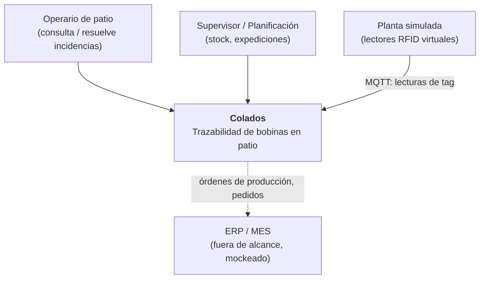
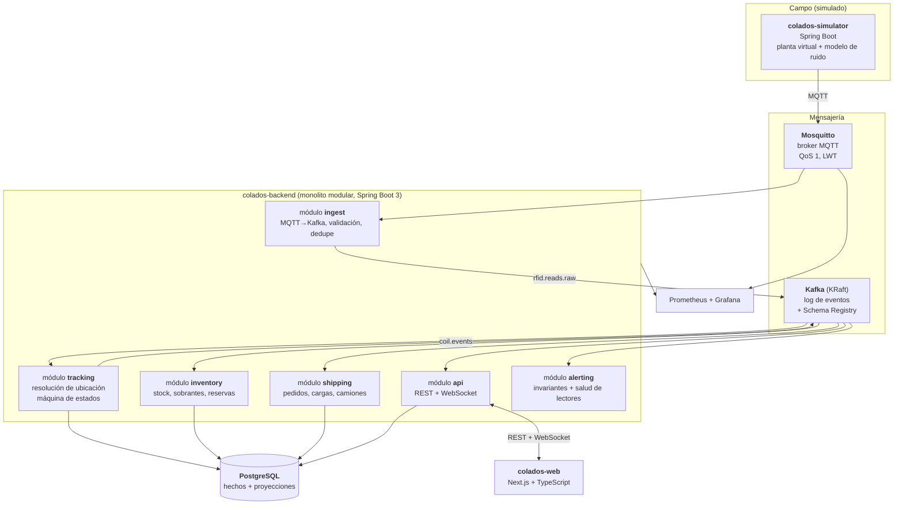

# 02 — Arquitectura

## 1. Principios que ordenan el diseño

1. **El simulador no sabe nada del dominio de negocio.** Emite lecturas crudas de tag
   por MQTT y punto. No conoce la base de datos, no llama a la API, no dice dónde está
   nada. Si mañana llega hardware real, se sustituye el simulador y nada más cambia.
   ([ADR-0006](adr/0006-simulador-emite-solo-lecturas-crudas.md))
2. **Los hechos son inmutables; el estado es una opinión derivada.** Las lecturas y
   los eventos de dominio se guardan para siempre; la ubicación actual es una proyección
   recalculable.
3. **Preferir un monolito modular a microservicios prematuros.** Las fronteras se
   trazan en módulos con contratos explícitos, no en despliegues.
   ([ADR-0003](adr/0003-monolito-modular.md))
4. **El sistema debe poder decir "no lo sé".** Confianza y frescura del dato son
   ciudadanos de primera clase, no un detalle de la UI.
5. **Todo se levanta con un `docker compose up`.** Si el entorno local cuesta,
   el proyecto muere.

## 2. Contexto (C4 nivel 1)



## 3. Contenedores (C4 nivel 2)



### Por qué el módulo `ingest` no es un simple bridge

Existen puentes MQTT→Kafka de estantería (Kafka Connect, el bridge nativo de EMQX).
Se descarta usarlos como única pieza porque queremos una **puerta de calidad** en
la entrada, y esa puerta es parte del aprendizaje:

- **Validación de esquema**: una lectura malformada va a la DLQ, no rompe el consumidor.
- **Idempotencia**: `(readerId, ingestSeq)` como clave; MQTT QoS 1 garantiza
  *at-least-once*, así que los duplicados de transporte llegan seguro.
- **Normalización de reloj**: se registran `read_at` y `received_at` y se mide el desfase.
- **Enriquecimiento mínimo**: se añade `plantId`, `receivedAt`, `traceId`.
- **Particionado consciente**: clave de Kafka = `epc`, para que todas las lecturas de
  una misma bobina caigan en la misma partición y se puedan ordenar y ventanear.

Ojo con lo último: si se particiona por `readerId` en vez de por `epc`, el motor de
resolución no puede razonar sobre una bobina sin barajar particiones. La decisión de
clave de partición **es** una decisión de arquitectura.

## 4. El componente central: resolución de ubicación

Todo lo demás es infraestructura. Este módulo es el proyecto:

```
lecturas crudas (sucias, duplicadas, desordenadas, incompletas)
        ↓  ventana deslizante por EPC
        ↓  precedencia por tipo de lector
        ↓  histéresis y tiempo de permanencia (dwell)
        ↓  RSSI como desempate entre antenas solapadas
        ↓  detección de contradicción
ubicación con confianza + eventos de dominio
```

Detalle completo del algoritmo, con los cuatro modos de fallo del RFID real que
tiene que absorber, en [`05-resolucion-ubicacion.md`](05-resolucion-ubicacion.md).

## 5. Topología del patio simulado

```
PATIO
├── ZONA A (cubierta)      calles A1..A4 × 20 huecos, apilable ×2
├── ZONA B (cubierta)      calles B1..B3 × 20 huecos, apilable ×2
├── ZONA C (exterior)      calles C1..C5 × 24 huecos, sin apilar
├── ZONA D (exterior)      calles D1..D2 × 24 huecos, sin apilar
└── ZONA E (expedición)    playa de carga, 12 posiciones

Lectores
├── ZONE_READER   1 por calle, 2–4 antenas, cobertura solapada entre calles contiguas
├── MACHINE_READER 1 por máquina, antena en el mástil, alcance corto
├── GATE_READER   salida de línea, báscula, puerta de expedición
└── HANDHELD      lector de mano del operario (inventario puntual, alta confianza)
```

El **solapamiento deliberado** entre calles contiguas es lo que genera ambigüedad y
obliga a que el motor de resolución use RSSI e histéresis. Sin solapamiento el
problema sería trivial y no se parecería a la realidad.

## 6. Frontend

Next.js + TypeScript. Vistas:

| Vista | Contenido |
|---|---|
| **Mapa de patio** | Plano 2D (SVG/Canvas) con zonas, calles y huecos coloreados por ocupación, estado y confianza. Actualización en vivo por WebSocket. |
| **Ficha de bobina** | Datos, colada de origen, linaje de sobrantes y **línea de tiempo completa** de eventos. La trazabilidad que en 2021 no existía. |
| **Stock** | Por aleación / espesor / ancho. Libre vs reservado vs expedido. Sobrantes destacados. |
| **Expediciones** | Pedidos, preparación de carga, camión, albarán. |
| **Alertas** | Invariantes violadas, bobinas `MISSING`, ubicaciones `DISPUTED`, lectores caídos. |
| **Consola del simulador** | Velocidad de simulación, perillas de ruido, inyección de anomalías. Convierte la demo en algo interactivo. |

La consola del simulador es, para un proyecto de portfolio, la vista más valiosa:
permite subir la tasa de lecturas perdidas al 30 % en directo y enseñar cómo el
sistema pasa de "ubicación confirmada" a "confianza baja" y luego a `MISSING`.

## 7. Transporte al navegador

WebSocket con STOMP sobre Spring. Se descarta SSE pese a ser más simple porque
la consola del simulador necesita canal de vuelta y no queremos dos mecanismos.

Topics de suscripción:
```
/topic/yard/{zoneId}      cambios de ocupación de una zona
/topic/coil/{coilId}      eventos de una bobina concreta
/topic/alerts             alertas
/topic/sim/status         estado del simulador
```

## 8. Observabilidad

Sin esto no se puede razonar sobre un sistema de eventos:

- **Métricas**: lecturas/s por lector, ratio de descarte, lag de consumidor Kafka,
  latencia lectura→ubicación resuelta (p50/p95/p99), bobinas en `MISSING`, `DISPUTED`.
- **Trazas**: `traceId` propagado desde la lectura MQTT hasta el mensaje WebSocket.
  Poder seguir *una* lectura por todo el sistema es lo que hace depurable esto.
- **Métrica estrella**: *precisión de ubicación*. Como el simulador **conoce la verdad
  física**, puede publicar la posición real por un canal aparte (`sim.groundtruth`)
  que el backend **no consume**, pero contra el que se puede evaluar. Da un número
  objetivo: "el motor de resolución acierta el 97,3 % de las ubicaciones con 15 % de
  lecturas perdidas". Eso es un resultado presentable, no una opinión.

## 9. Alternativas consideradas y descartadas

| Alternativa | Por qué no |
|---|---|
| Solo MQTT + Postgres, sin Kafka | Suficiente para funcionar, pero se pierde el replay, que es el mayor valor didáctico y práctico. Se mantiene como plan B si Kafka lastra el desarrollo (ver ADR-0002). |
| Solo Kafka, sin MQTT | Kafka no es un protocolo de campo: no hay clientes en microcontroladores, ni QoS por mensaje, ni Last Will. Perdería el realismo industrial. |
| RabbitMQ en lugar de ambos | Buena cola, mal log. Sin retención larga ni replay ni reproceso desde offset. |
| Redis Streams | Ligero y con consumer groups, pero la retención y el ecosistema de stream processing quedan cortos. |
| Microservicios desde el día 1 | Coste operativo desproporcionado para un proyecto personal; las fronteras del dominio aún no están estabilizadas. |
| Event sourcing puro (sin tablas de estado) | Consultas de stock y mapa de patio se vuelven costosas. Se opta por híbrido (ADR-0004). |
| MongoDB | Los invariantes del dominio son relacionales (ocupación de huecos, reservas). Postgres con `jsonb` cubre la parte flexible. |
| Simulador en Python | Más rápido de escribir y con mejores librerías de simulación, pero añade un segundo toolchain. Decisión pendiente de confirmar. |

## 10. Repositorio

Monorepo:

```
colados/
├── docs/
├── simulator/          Spring Boot — planta virtual
├── backend/            Spring Boot — monolito modular
│   ├── ingest/
│   ├── tracking/
│   ├── inventory/
│   ├── shipping/
│   ├── alerting/
│   └── api/
├── contracts/          esquemas de eventos compartidos (fuente de verdad)
├── web/                Next.js
├── infra/              docker-compose, configuración Mosquitto/Kafka, dashboards Grafana
└── tools/              generación de datos, scripts de evaluación
```

`contracts/` es un módulo aparte y deliberadamente aburrido: define los esquemas de
evento y genera los tipos de Java y de TypeScript. Es la única dependencia que
simulador, backend y web comparten, y evita que los tres deriven por su cuenta.
