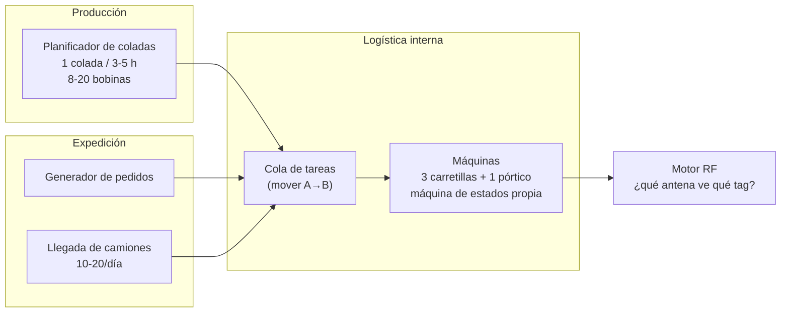

# 04 — El simulador

El simulador no es un script de pruebas: es un componente de primera clase con más
código de dominio físico que el propio backend. Su calidad determina si el proyecto
demuestra algo o no.

## 1. Responsabilidad y frontera

**Hace:**
- Modela la planta física: patio, huecos, máquinas, coladas, camiones, pedidos.
- Simula qué antena vería qué tag, con qué potencia y cuándo.
- Aplica un modelo de ruido configurable.
- Publica `TagRead` y `ReaderStatus` por MQTT.
- Publica la verdad física por `sim/groundtruth` **solo para evaluación**.

**No hace, nunca:**
- Conectarse a PostgreSQL ni a la API del backend.
- Publicar eventos de dominio (`CoilPlaced`, etc.).
- Incluir `coilId`, `slotId` o `zoneId` en una lectura.

Esa frontera se comprueba con un test: el módulo del simulador no puede depender de
los paquetes de dominio del backend.

## 2. Modelo físico

### Geometría

Patio como rejilla 2D con coordenadas en metros. Cada `Slot` tiene posición `(x, y)`
y nivel de apilamiento. Cada antena tiene posición, orientación y un patrón de
cobertura (elipse con eje mayor en la dirección de apuntamiento).

### Actores

Cada máquina ejecuta un ciclo con duraciones muestreadas de una distribución:
`IDLE → DESPLAZAMIENTO(a origen) → RECOGIDA → DESPLAZAMIENTO(a destino) → DEPÓSITO → IDLE`

Durante el desplazamiento la máquina **atraviesa calles que no son su destino**. Ahí
es donde nacen las lecturas fantasma que el backend tiene que descartar. Si el
simulador teletransportase las bobinas, el problema interesante desaparecería.

### Motor RF

En cada tick (por defecto 200 ms), para cada tag y cada antena:

1. Distancia y ángulo tag↔antena.
2. ¿Dentro del patrón de cobertura? Si no, no hay lectura.
3. `RSSI = P0 − 10·n·log10(d) + ruido_gaussiano`, con `n ≈ 2,2` (path loss) y
   atenuación adicional si hay bobinas metálicas en medio (el aluminio es un
   reflector pésimo para RFID: eso es parte del realismo, no un bug).
4. Probabilidad de lectura en función del RSSI (curva sigmoide). Cerca ≈ 20 lecturas/s,
   en el borde de cobertura ≈ 1 lectura cada varios segundos e intermitente.
5. Aplicar el modelo de ruido.

## 3. Modelo de ruido — las perillas

Configurables en caliente desde la consola web. **Es la parte más valiosa del
simulador**, porque cada perilla corresponde a un modo de fallo real del RFID:

| Perilla | Por defecto | Fenómeno real que reproduce |
|---|---|---|
| `missRate` | 0,15 | Tag orientado hacia el metal, agua, apantallamiento |
| `phantomRate` | 0,02 | Lectura de un tag que está en la calle contigua (multitrayecto) |
| `crossReadRate` | 0,08 | Antena de la calle C lee un tag de la calle B (solapamiento) |
| `duplicateRate` | 0,05 | El transporte duplica el mensaje |
| `clockSkewMs` | ±2000 | El reloj del lector va desfasado |
| `clockDriftPpm` | 50 | Deriva progresiva del reloj |
| `outOfOrderRate` | 0,03 | Mensajes que llegan desordenados |
| `networkDropS` | 0 | Corte de red: el lector deja de publicar N segundos (dispara LWT) |
| `tagFailureRate` | 0,001 | Tag que muere definitivamente → bobina invisible para siempre |
| `wrongTagRate` | 0,001 | Etiqueta puesta en la bobina equivocada — el fallo más pernicioso |
| `manualErrorRate` | 0,05 | El operario deja la bobina en un hueco distinto al indicado |

Las dos últimas merecen atención:

- **`wrongTagRate`**: el sistema es *internamente coherente* y aun así está diciendo
  una mentira, porque el vínculo físico tag↔bobina es falso. Ningún algoritmo lo
  detecta desde los datos RFID; solo un contraste externo (peso en báscula,
  inventario con lector de mano) lo descubre. Merece la pena implementarlo para
  poder decir con datos dónde están los límites del sistema.
- **`manualErrorRate`**: la máquina lleva la bobina a un hueco distinto del planificado.
  Este es el caso que demuestra el valor del proyecto: el sistema **detecta la
  discrepancia entre lo planificado y lo real**, que es justo lo que el proceso en
  papel de 2021 no podía hacer.

## 4. Control de tiempo

| Modo | Uso |
|---|---|
| `realtime` (×1) | Demo en vivo |
| `accelerated` (×10 … ×1000) | Generar semanas de historia en minutos |
| `stepped` | Tick a tick, para depurar el motor de resolución |
| `replay` | Reproducir una traza grabada — indispensable para tests deterministas |

**Semilla aleatoria fija y configurable.** Con la misma semilla y los mismos
parámetros, el simulador produce exactamente la misma traza. Sin eso, no hay tests
reproducibles ni comparación honesta entre dos versiones del algoritmo de resolución.

## 5. Escenarios predefinidos

Guardados como YAML en `simulator/scenarios/`, ejecutables desde la UI:

| Escenario | Qué demuestra |
|---|---|
| `nominal` | Operación normal, ruido bajo. Línea base. |
| `turno-punta` | 3 coladas seguidas, todas las máquinas ocupadas, saturación |
| `lector-caido` | Un lector de zona cae 10 min → LWT, degradación de confianza, recuperación |
| `patio-lleno` | Ocupación >95 % → conflictos de hueco, invariante 2 |
| `tormenta-ruido` | `missRate` 0,4 → cómo cae la precisión y el sistema lo admite |
| `bobina-perdida` | Fallo de tag → `MISSING` → resolución con lector de mano |
| `error-humano` | Bobina depositada en hueco equivocado → detección de discrepancia |
| `expedicion` | Pedido completo: reserva → preparación → carga → salida |

Cada escenario es a la vez una demo y un test de aceptación de extremo a extremo.

## 6. Evaluación: la métrica que da un número

El simulador conoce la verdad. Publicándola en `sim/groundtruth` (que el backend
**no consume**) se puede calcular:

- **Precisión de ubicación**: % de instantes en que la ubicación del backend coincide
  con la real.
- **Latencia de convergencia**: segundos desde que la bobina se deposita hasta que el
  backend lo afirma con confianza alta.
- **Tasa de falsos `MISSING`** y de falsos `DISPUTED`.
- **Curva precisión vs `missRate`**: la gráfica que resume el proyecto.

Poder decir *"con 15 % de lecturas perdidas el sistema ubica correctamente el 97 % de
las bobinas y converge en 8 s de mediana"* es un resultado medido. Es lo que separa
esto de una demo bonita.

## 7. Tecnología

Spring Boot, mismo toolchain que el backend, ejecutable independiente. Ver
[ADR-0007](adr/0007-tecnologia-del-simulador.md) — decisión pendiente de confirmar
frente a la alternativa en Python con SimPy.
