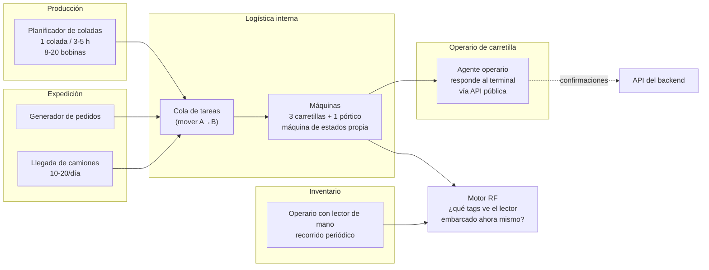

# 04 — El simulador

El simulador no es un script de pruebas: es un componente de primera clase con más
código de dominio físico que el propio backend. Su calidad determina si el proyecto
demuestra algo o no.

## 1. Responsabilidad y frontera

**Hace:**
- Modela la planta física: patio, huecos, tags de ubicación, máquinas, coladas,
  camiones, pedidos.
- Simula al **operario** de la carretilla, que responde a las preguntas del terminal
  usando la API pública igual que una persona ([ADR-0012](adr/0012-terminal-y-gestion-por-excepcion.md)).
- Simula qué lector de máquina vería qué tags, con qué potencia y cuándo.
- Aplica un modelo de ruido configurable.
- Publica `TagReadBatch` y `ReaderStatus` por MQTT.
- Publica la verdad física por `sim/groundtruth` **solo para evaluación**.

**No hace, nunca:**
- Conectarse a PostgreSQL ni a endpoints privilegiados. El agente operario usa **solo la
  API pública**, la misma que la pantalla real, y **solo responde cuando se le pregunta**.
- Publicar eventos de dominio (`CoilPlaced`, etc.).
- Incluir `coilId`, `slotId` o `zoneId` en una lectura.
- Distinguir en el payload si un EPC es de bobina o de ubicación — **eso lo resuelve el
  backend** contra el registro de tags. El lector solo ve códigos.

Esa frontera se comprueba con un test: el módulo del simulador no puede depender de los
paquetes de dominio del backend.

## 2. Modelo físico

### Geometría

Patio como rejilla 2D con coordenadas en metros. Cada `Slot` tiene posición `(x, y)`,
nivel de apilamiento y **un tag de ubicación** con su EPC, empotrado en el suelo o en
la estructura.

Cada máquina tiene una posición que evoluciona en el tiempo y un lector embarcado con
un patrón de cobertura corto (elipse de ~4-6 m en la dirección de avance), más una zona
de agarre a ~1 m donde va la bobina transportada.

### Actores

Cada máquina ejecuta un ciclo con duraciones muestreadas de una distribución:
`INACTIVA → DESPLAZAMIENTO(a origen) → RECOGIDA → DESPLAZAMIENTO(a destino) → DEPÓSITO → INACTIVA`

Durante el desplazamiento la máquina **atraviesa calles que no son su destino** y su
lector va viendo los tags de ubicación por los que pasa. Distinguir esos tags de paso
del tag del hueco de destino es justo el problema que el backend tiene que resolver.

### Motor RF

En cada tick (por defecto 200 ms), para cada lector de máquina:

1. **Bobina transportada** (si la lleva): distancia ~1 m fija →
   RSSI alto y estable (−38 a −45 dBm), probabilidad de lectura ~95 % por intento.
2. **Tags de ubicación**: para cada uno dentro del patrón de cobertura, distancia y
   ángulo → `RSSI = P0 − 10·n·log10(d) + ruido_gaussiano` con `n ≈ 2,2`.
3. **Probabilidad de lectura** en función del RSSI (curva sigmoide): cerca ≈ 20
   lecturas/s, en el borde de cobertura intermitente.
4. **Atenuación por metal**: un tag de ubicación bajo una bobina depositada queda
   prácticamente inaccesible. El aluminio es un reflector pésimo para RFID, y eso es
   realismo, no un bug.
5. **Bobinas de otras máquinas cercanas**: se leen con RSSI mucho más bajo (−60 a
   −75 dBm) y de forma intermitente. Es la contaminación entre máquinas.
6. Aplicar el modelo de ruido y empaquetar todo en el lote de 200 ms.

**Volumen resultante:** ~80 lecturas/s por máquina activa, ~300/s en punta con las
cuatro trabajando, y **cero cuando están paradas**. El volumen es proporcional a la
actividad, no al inventario almacenado ([ADR-0010](adr/0010-lector-en-la-maquina.md)).

## 3. Modelo de ruido — las perillas

Configurables en caliente desde la consola web. **Es la parte más valiosa del
simulador**, porque cada perilla corresponde a un modo de fallo real del RFID:

| Perilla | Por defecto | Fenómeno real que reproduce |
|---|---|---|
| `missRate` | 0,10 | Tag orientado hacia el metal, agua, apantallamiento |
| `locationTagUnreadableRate` | 0,05 | Tag de ubicación sucio, pisado, tapado por otra bobina |
| `locationTagDeadRate` | 0,002 | Tag de ubicación roto permanentemente → hueco ciego |
| `crossMachineReadRate` | 0,06 | La carretilla A lee la bobina que lleva la B |
| `dropDetectionJitterMs` | ±1500 | El tag se desvanece antes o después del momento real del depósito |
| `duplicateRate` | 0,05 | El transporte duplica el lote |
| `clockSkewMs` | ±2000 | El reloj del lector va desfasado |
| `clockDriftPpm` | 50 | Deriva progresiva del reloj |
| `outOfOrderRate` | 0,03 | Lotes que llegan desordenados |
| `networkDropS` | 0 | Corte de red: el lector deja de publicar N segundos (dispara LWT) |
| `tagFailureRate` | 0,001 | Tag de bobina que muere → bobina invisible para siempre |
| `wrongTagRate` | 0,001 | Etiqueta puesta en la bobina equivocada |
| `manualErrorRate` | 0,05 | El operario deja la bobina en un hueco distinto al indicado |
| `operatorConfirmDelayS` | 5–60 | Tarda en contestar al terminal; sigue conduciendo y confirma luego |
| `operatorRubberStampRate` | 0,10 | **Confirma el destino propuesto sin mirar**, aunque la haya dejado en otro sitio |
| `operatorIgnoreRate` | 0,05 | No contesta: la pregunta queda pendiente |
| `operatorMistapRate` | 0,02 | Selecciona el hueco de al lado en la pantalla |
| `unloggedMoveRate` | 0,01 | Una bobina se mueve con una máquina sin lector → deriva pura |

Cinco merecen atención especial en esta arquitectura:

- **`dropDetectionJitterMs`**: ataca directamente al punto débil del diseño. Toda la
  ubicación depende de acertar el instante en que la bobina deja de leerse; desplazarlo
  un segundo y medio puede colocarla en el hueco de al lado. Es la perilla que mejor
  mide la robustez del motor de resolución.
- **`locationTagUnreadableRate`**: produce depósitos sin ubicación conocida, que es
  como se ejercita el estado `LOCATION_UNKNOWN` y la cola de inventario.
- **`unloggedMoveRate`**: bobina movida sin que ningún lector se entere. **Es
  indetectable hasta el siguiente inventario**, y por eso es la perilla que justifica
  que el inventario exista. Sin ella, el inventario parecería un adorno.
- **`operatorRubberStampRate`**: produce datos **internamente coherentes y falsos**,
  porque el sistema recibe una confirmación humana —la fuente que considera más fiable—
  que es mentira. Solo se detecta cruzándola con la lectura RF o con un inventario
  posterior. Es el argumento cuantitativo de por qué conviene preguntar poco: **cuanto
  más preguntas, más se pulsa sin mirar.**
- **`wrongTagRate`**: el sistema es internamente coherente y aun así miente, porque el
  vínculo físico tag↔bobina es falso. Ningún algoritmo lo detecta desde los datos RFID;
  solo un contraste externo (peso en báscula, inventario) lo descubre. Merece la pena
  implementarlo para poder decir con datos dónde están los límites del sistema.

## 4. Control de tiempo

| Modo | Uso |
|---|---|
| `realtime` (×1) | Demo en vivo |
| `accelerated` (×10 … ×1000) | Generar semanas de historia en minutos |
| `stepped` | Tick a tick, para depurar el motor de resolución |
| `replay` | Reproducir una traza grabada — indispensable para tests deterministas |

**Semilla aleatoria fija y configurable.** Con la misma semilla y los mismos parámetros,
el simulador produce exactamente la misma traza. Sin eso no hay tests reproducibles, ni
comparación honesta entre dos versiones del algoritmo, ni el archivo de lecturas crudas
del que habla [ADR-0009](adr/0009-estrategia-de-almacenamiento.md).

## 5. Escenarios predefinidos

Guardados como YAML en `simulator/scenarios/`, ejecutables desde la UI:

| Escenario | Qué demuestra |
|---|---|
| `nominal` | Operación normal, ruido bajo. Línea base. |
| `turno-punta` | 3 coladas seguidas, todas las máquinas ocupadas, saturación |
| `lector-caido` | El lector de una carretilla cae 10 min → LWT, movimientos ciegos, recuperación |
| `tags-ilegibles` | Una calle con tags de ubicación sucios → depósitos en `LOCATION_UNKNOWN` |
| `patio-lleno` | Ocupación >95 % → conflictos de hueco, invariante 2 |
| `deriva-silenciosa` | `unloggedMoveRate` alto → el inventario se degrada sin que nadie lo note, hasta que pasa el lector de mano |
| `dos-carretillas-juntas` | Contaminación cruzada entre máquinas en la misma calle |
| `error-humano` | Bobina depositada en hueco equivocado → detección de discrepancia |
| `inventario` | Recorrido completo con lector de mano: confirmaciones, discrepancias y resolución de `LOCATION_UNKNOWN` |
| `operario-de-piloto-automatico` | `operatorRubberStampRate` al 40 % → confirmaciones falsas coherentes, detectadas solo al cruzarlas con RF |
| `expedicion` | Pedido completo: reserva → preparación → carga → salida |

Cada escenario es a la vez una demo y un test de aceptación de extremo a extremo.

## 6. Evaluación: la métrica que da un número

El simulador conoce la verdad. Publicándola en `sim/groundtruth` (que el backend **no
consume**) se puede calcular:

- **Precisión de ubicación**: % de bobinas cuya ubicación en el backend coincide con la
  real. Medida **justo después de cada depósito** y **a los 7 días**, que con esta
  arquitectura son dos números muy distintos.
- **Error de vecindad**: cuando falla, ¿en qué hueco la coloca? Fallar al hueco
  contiguo no es lo mismo que fallar a otra calle.
- **Latencia de convergencia**: segundos desde el depósito físico hasta que el backend
  lo afirma.
- **Movimientos resueltos sin preguntar** — la métrica de cabecera
  ([ADR-0012](adr/0012-terminal-y-gestion-por-excepcion.md)): mide si el motor mejora.
- **Tasa de `LOCATION_UNKNOWN`** y cuántos resuelve el inventario.
- **Deriva acumulada**: cuánto se degrada la precisión entre inventarios. Es **la
  gráfica que resume esta arquitectura**, porque mide exactamente lo que se perdió al
  renunciar a los lectores fijos.

Poder decir *"tras el depósito acierta el 98 % de las ubicaciones; a los 7 días sin
inventario cae al 91 %, y un recorrido con lector de mano lo devuelve al 99 %"* es un
resultado medido, y además argumenta por sí solo cada cuánto conviene inventariar.

## 7. Tecnología

**Java 21 + Spring Boot**, mismo toolchain que el backend, ejecutable independiente
([ADR-0007](adr/0007-tecnologia-del-simulador.md)).

Piezas propias que hay que escribir, al no usar SimPy:

- **Reloj virtual + cola de eventos**: cola de prioridad por instante de simulación, con
  factor de escala configurable. Unas 200 líneas.
- **Fuente de aleatoriedad con semilla**, inyectada, nunca `Math.random()` — sin esto no
  hay reproducibilidad y el modo `replay` no sirve para nada.
- **Motor RF**: geometría y modelo de propagación (sección 2).

Para el análisis de las trazas (curvas de precisión, comparación entre versiones del
resolutor) el arnés de evaluación exporta a CSV/Parquet y el análisis se hace fuera del
ciclo de build. Es lo que se pierde al no usar Python, y se asume conscientemente.
